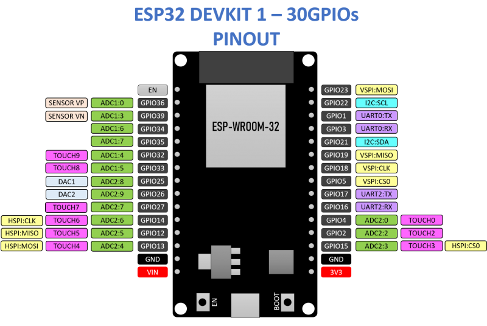
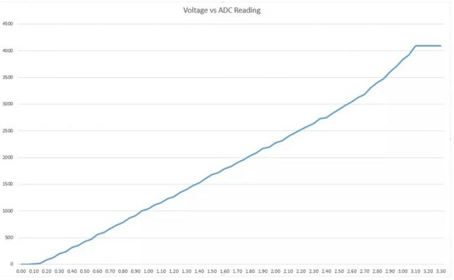

# ESP32简介

### ESP32开发板引脚图

### ESP32外围设备 
- 18个模数转换器（ADC）通道
- 3个SPI接口
- 3个UART接口
- 2个I2C接口
- 16个脉冲宽度调制输出通道
- 2个数模转换器（DAC）
- 2个I2S接口
- 10个电容传感GPIO

| GPIO   | Input                               | Output                        | 说明                                                |
| ------ | ----------------------------------- | ----------------------------- | --------------------------------------------------- |
| **0**  | pulled up | OK  | 开机时输出PWM信号，必须为LOW才能进入闪烁模式        |
| **1**  | TX pin       | OK  | 开机调试输出                                        |
| **2**  | OK         | OK   | 连接到板载LED，必须悬空或处于低电平才能进入闪烁模式 |
| **3**  | OK        | RX pin |                                                     |
| **4**  | OK         | OK   |                                                     |
| **5**  | OK         | OK   | 启动时输出PWM信号，捆扎引脚                         |
| **6**  | X            | X      | 连接到集成SPI闪存（flash）                          |
| **7**  | X            | X      | 连接到集成SPI闪存（flash）                          |
| **8**  | X            | X      | 连接到集成SPI闪存（flash）                          |
| **9**  | X            | X      | 连接到集成SPI闪存（flash）                          |
| **10** | X            | X      | 连接到集成SPI闪存（flash）                          |
| **11** | X            | X      | 连接到集成SPI闪存（flash）                          |
| **12** | OK        | OK   | 如果拉高，则启动失败，捆扎引脚                      |
| **13** | OK         | OK   |                                                     |
| **14** | OK         | OK   | 开机输出PWM信号                                     |
| **15** | OK         | OK   | 在启动时输出PWM，捆扎引脚                           |
| **16** | OK         | OK   |                                                     |
| **17** | OK         | OK   |                                                     |
| **18** | OK         | OK   |                                                     |
| **19** | OK         | OK   |                                                     |
| **21** | OK         | OK   |                                                     |
| **22** | OK         | OK   |                                                     |
| **23** | OK         | OK   |                                                     |
| **24** | OK         | OK   |                                                     |
| **25** | OK         | OK   |                                                     |
| **26** | OK         | OK   |                                                     |
| **27** | OK         | OK   |                                                     |
| **32** | OK         | OK   |                                                     |
| **33** | OK         | OK   |                                                     |
| **34** | OK         |                               |                                                     |
| **35** | OK         |                               |                                                     |
| **36** | OK         |                               |                                                     |
| **39** | OK         |                               |                                                     |

> ⚠️以下三类引脚不建议使用或限制使用的引脚
### 捆扎引脚（Strapping pins）：
- GPIO 0
- GPIO 2
- GPIO 4
- GPIO 5（启动期间必须为高）
- GPIO 12（启动期间必须低）
- GPIO 15（启动期间必须为高）

这些用于将ESP32置于引导加载程序或烧录模式。在大多数内置USB/Serial的开发板上，您不需要担心这些管脚的状态。电路板使引脚处于正确的烧录或启动模式。有关ESP32引导模式选择的更多信息，请参见此处。

但是，如果你有外设连接到这些引脚，你可能会有困难，试图上传新的代码，用新固件烧录ESP32或重置板。如果您有一些外设连接到Strapping pins，并且您在上载代码或烧录ESP32时遇到问题，可能是因为这些外设阻止ESP32进入正确的模式。请阅读引导模式选择文档以指导您朝正确的方向前进。复位、烧录或启动后，这些引脚按预期工作。

### 仅输入引脚

GPIO34到39是GPIs–仅输入的管脚。这些引脚没有内部上拉或下拉电阻。它们不能用作输出，因此只能将这些管脚用作输入：
- GPIO 34
- GPIO 35
- GPIO 36
- GPIO 39

### 集成在ESP-WROOM-32SPI闪存的引脚

GPIO 6到GPIO 11在一些ESP32开发板中是公开的。但是，这些引脚连接到ESP-WROOM-32芯片上的集成SPI闪存，不建议用于其他用途。所以，不要在项目中使用这些管脚：

- GPIO 6（SCK/CLK）
- GPIO 7（SDO/SD0）
- GPIO 8（SDI/SD1）
- GPIO 9（SHD/SD2）
- GPIO 10（SWP/SD3）
- GPIO 11（CSC/CMD）

> 以上三类引脚不建议使用或限制使用

### 电容式触摸GPIO

ESP32有10个内部电容式触摸传感器。它们能感应到任何带电物质的变化，比如人类皮肤。因此，他们可以检测到当用手指触摸gpio时引起的变化。这些引脚可以很容易地集成到电容垫，并取代机械按钮。电容式触针也可以用来唤醒ESP32的深度睡眠。

这些内部触摸传感器连接到这些GPIO：

- T0 (GPIO 4)
- T1 (GPIO 0)
- T2 (GPIO 2)
- T3 (GPIO 15)
- T4 (GPIO 13)
- T5 (GPIO 12)
- T6 (GPIO 14)
- T7 (GPIO 27)
- T8 (GPIO 33)
- T9 (GPIO 32)

### 模数转换器（ADC）

ESP32有18 x 12位ADC输入通道（而ESP8266只有1 x 10位ADC）。这些是可用作ADC和相应通道的GPIO：

|         | ADC1    | ADC2    |
| ------- | ------- | ------- |
| **CH0** | GPIO 36 | GPIO 4  |
| **CH1** | GPIO 37 | GPIO 0  |
| **CH2** | GPIO 38 | GPIO 2  |
| **CH3** | GPIO 39 | GPIO 15 |
| **CH4** | GPIO 32 | GPIO 13 |
| **CH5** | GPIO 33 | GPIO 12 |
| **CH6** | GPIO 34 | GPIO 14 |
| **CH7** | GPIO 35 | GPIO 27 |
| **CH8** |         | GPIO 37 | GPIO 25 |
| **CH9** |         | GPIO 37 | GPIO 26 |
⚠️注意：使用Wi-Fi时不能使用ADC2管脚。因此，如果您使用Wi-Fi，并且无法从ADC2 GPIO获取值，则可以考虑改用ADC1 GPIO，这应该可以解决您的问题。

ADC输入通道具有12位分辨率。这意味着您可以获得0到4095之间的模拟读数，其中0对应于0V，4095对应于3.3V。您还可以在代码上设置通道的分辨率以及ADC范围。

ESP32 ADC引脚没有线性行为。您可能无法区分0和0.1V，或3.2和3.3V。在使用ADC引脚时，您需要记住这一点。您将得到类似于下图所示的行为。

;

### 数模转换器（DAC）

ESP32上有2 x 8位DAC通道，用于将数字信号转换为模拟电压信号输出。这些是DAC通道：

- DAC1 (GPIO25)
- DAC2 (GPIO26)

### RTC GPIOs

ESP32支持RTC GPIO。当ESP32处于深度睡眠状态时，可以使用路由到RTC低功耗子系统的GPIO。这些RTC gpio可用于在超低功耗（ULP）协处理器运行时将ESP32从深度睡眠中唤醒。以下GPIO可以用作外部唤醒源。

- RTC_GPIO0 (GPIO36)
- RTC_GPIO3 (GPIO39)
- RTC_GPIO4 (GPIO34)
- RTC_GPIO5 (GPIO35)
- RTC_GPIO6 (GPIO25)
- RTC_GPIO7 (GPIO26)
- RTC_GPIO8 (GPIO33)
- RTC_GPIO9 (GPIO32)
- RTC_GPIO10 (GPIO4)
- RTC_GPIO11 (GPIO0)
- RTC_GPIO12 (GPIO2)
- RTC_GPIO13 (GPIO15)
- RTC_GPIO14 (GPIO13)
- RTC_GPIO15 (GPIO12)
- RTC_GPIO16 (GPIO14)
- RTC_GPIO17 (GPIO27)

### 脉冲宽度调制

ESP32 LED PWM控制器有16个独立通道，可以配置为生成具有不同特性的PWM信号。所有可以作为输出的管脚都可以用作PWM管脚（GPIOs 34到39不能产生PWM）。

要设置脉冲宽度调制信号，需要在代码中定义这些参数：

信号频率；

占空比；

脉宽调制通道；

要输出信号的GPIO。

### I2C

ESP32有两个I2C通道，任何管脚都可以设置为SDA或SCL。将ESP32与Arduino IDE一起使用时，默认I2C引脚为：

- GPIO 21（SDA）
- GPIO 22（SCL）

如果要使用其他管脚，在使用导线库时，只需调用：

Wire.begin(SDA, SCL);

SPI

默认情况下，SPI的pin映射为：

| SPI      | MOSI    | MISO    | CLK     | CS      |
| -------- | ------- | ------- | ------- | ------- |
| **VSPI** | GPIO 23 | GPIO 19 | GPIO 18 | GPIO 5  |
| **HSPI** | GPIO 13 | GPIO 12 | GPIO 14 | GPIO 15 |

### 中断

所有GPIO都可以配置为中断。

Strapping pins

### Pins HIGH at Boot

一些GPIO在启动或重置时将其状态更改为高或输出PWM信号。这意味着，如果输出连接到这些gpio，则在ESP32重置或引导时可能会得到意外的结果。

- GPIO 1
- GPIO 3
- GPIO 5
- GPIO 6 to GPIO 11 (connected to the ESP32 integrated SPI flash memory – not recommended to use).
- GPIO 14
- GPIO 15

### 启用（EN）

启用（EN）是3.3V调节器的启用引脚。它被拉起来了，所以接地使3.3V调节器失效。例如，这意味着您可以使用连接到按钮的该管脚来重新启动ESP32。

GPIO电流消耗

根据ESP32数据表中的“推荐操作条件”部分，每个GPIO的绝对最大电流为40毫安。

ESP32内置霍尔效应传感器

ESP32还具有内置霍尔效应传感器，可检测周围磁场的变化。

### MircoPython

使用Thonny IDE进行开发
以下是MircoPython快速参考：
https://docs.micropython.org/en/latest/esp32/quickref.html